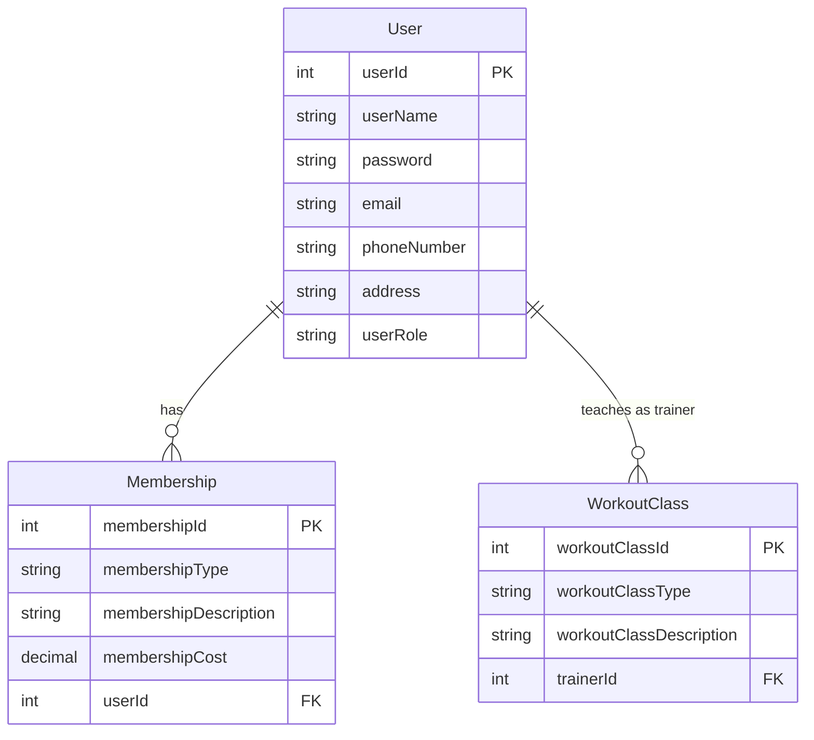

# Entity Relationship Diagram - Gym Management System

## Entity Descriptions

### User
- Primary entity storing information for all users (Admins, Trainers, and Members)
- `userId`: Unique identifier for each user
- `userRole`: Specifies the user type (Admin/Trainer/Member)
- Secured password storage using BCrypt hashing

### Membership
- Represents gym memberships purchased by users
- `membershipId`: Unique identifier for each membership
- `userId`: Foreign key linking to the User who owns the membership
- Tracks membership details and associated costs

### WorkoutClass
- Represents classes offered at the gym
- `workoutClassId`: Unique identifier for each class
- `trainerId`: Foreign key linking to the User (with Trainer role) who teaches the class